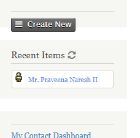

# uk.co.millertech.clearrecentitems



Adds Clear Recent Items button next to Recent Items heading. When clicked, clears recent items list and adds the current user as the rent item.

The extension is licensed under [AGPL-3.0](LICENSE.txt).

## Requirements

* PHP v5.4+
* CiviCRM 4.7+

## Installation (Web UI)

This extension has not yet been published for installation via the web UI.

## Installation (CLI, Zip)

Sysadmins and developers may download the `.zip` file for this extension and
install it with the command-line tool [cv](https://github.com/civicrm/cv).

```bash
cd <extension-dir>
cv dl uk.co.millertech.clearrecentitems@https://github.com/chamilwijesooriya/uk.co.millertech.clearrecentitems/archive/master.zip
```

## Installation (CLI, Git)

Sysadmins and developers may clone the [Git](https://en.wikipedia.org/wiki/Git) repo for this extension and
install it with the command-line tool [cv](https://github.com/civicrm/cv).

```bash
git clone https://github.com/chamilwijesooriya/uk.co.millertech.clearrecentitems.git
cv en clearrecentitems
```

## Usage

Click on Clear Recent Items button next to Recent Items heading to clear the list.


